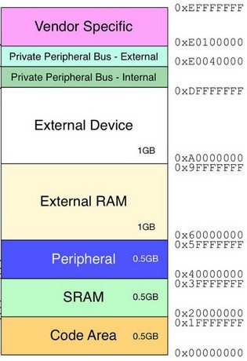
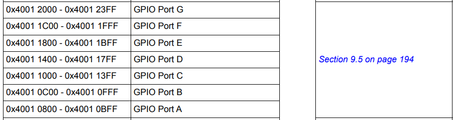
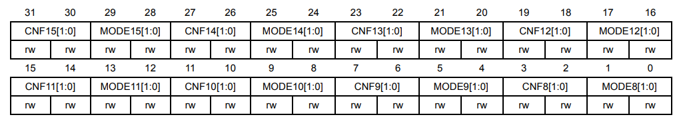
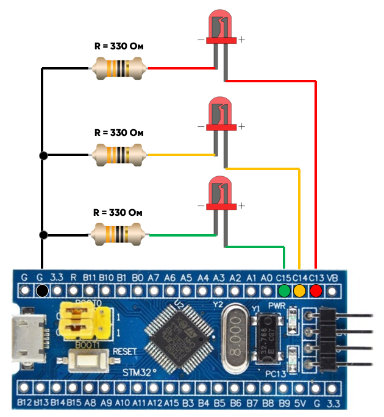
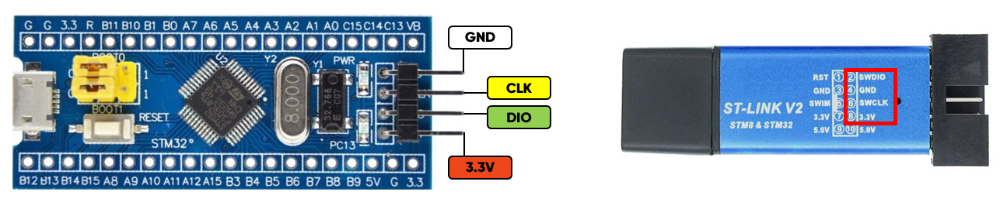

# Лабораторная работа №1. Регистры STM32, работа с GPIO
***Цель работы:*** изучение принципов работы с регистрами микроконтроллеров семейства STM32, изучение блока GPIO.

## Теоретическое ведение
### Организация памяти в микроконтроллерах STM32
В микроконтроллерах семейства STM32F1 память программ, данных, регистры и порты
ввода/вывода организованы внутри единого пространства адресов размером 4 Гб (32-битный адрес).  
На рисунке ниже показано, за что отвечают области памяти ядра ARM Cortex-M (на базе которого построены микроконтроллеры STM32).  
  

Для того, чтобы понять, какая область памяти отвечает за интересующий нас блок, обратимся к *Reference manual*.
В нем нас интересует раздел *Memory map*, в котором находится большая таблица, показывающая, 
за какой блок периферии отвечает тот или иной раздел памяти. Здесь же находятся ссылки на карту регистров каждого периферийного
устройства.  
В данной работе нас интересует блок GPIO (*General Purpose Input/Output*).  
  

Перейдя в нужный раздел по ссылке, мы можем видеть, какие регистры отвечают за блок портов ввода/вывода, 
их адреса в памяти (указывается смещение), а также значения по умолчанию. Именно путем установки нужных битов 
в этих регистрах производится предварительная настройка периферийных блоков и работа с ними. 

### Уровни абстракции
Перед тем, как перейти к написанию прошивки, было бы полезно рассмотреть существующие уровни абстракции 
для микроконтроллеров семейства STM32. Разработчику доступно несколько инструментов:  

**Работа c регистрами напрямую**. В этом случае, для того, чтобы зажечь светодиод, подключенный к порту PC13, нам
необходимо было бы написать следующий код:
~~~c
uint32_t * register_adr = (uint32_t *) 0x4001100CU;
*register_adr = 0x2000;
~~~
Здесь *0x4001100CU* - это адрес регистра GPIOC_ODR в памяти, а *0x2000* - его значение, соответствующее
высокому уровню на выходе порта PC13.  

**Использование библиотеки CMSIS**. Она содержит низкоуровневые, независящие от производителя методы для доступа 
к аппаратуре микроконтроллера. Помимо этого, она упрощает доступ к 
регистрам, позволяя обращаться к ним как к структурам, а также содержит макросы для удобной работы. 
Код для зажигания светодиода на ножке PC13 в данном случае выглядит так:
~~~c
SET_BIT(GPIOC->ODR, GPIO_ODR_ODR13);
~~~
В данном случае, SET_BIT - один из макросов. Первый аргумент - регистр, второй - название нужного бита.

**Использование HAL** - *Hardware Abstraction Layer*. Эта библиотека позволяет абстрагироваться от работы с регистрами. 
Используя ее, нет необходимости обращаться к даташиту каждого микроконтроллера, чтобы узнать, какой бит в каком регистре 
отвечает за необходимое действие периферийного блока. Тогда наш код становится еще проще:
~~~c
HAL_GPIO_WritePin(GPIOC, GPIO_PIN_13, GPIO_PIN_SET);
~~~  
В данной лабораторной работе мы рассмотрим работу с регистрами напрямую.

## Подготовка к выполнению работы
Откроем проект в **Keil uVision** и разберем код в файле *main.c*.  
Для того, чтобы периферийный блок GPIOC начал работать, необходимо включить его тактирование от шины APB2. 
Здесь нам потребуется обратиться к регистру *RCC_APB2ENR* (APB2 peripheral clock enable register) и установить в нем 
бит *IOPCEN* (IO port C clock enable) в логическую 1. Это включит тактирование порта C. 
В *Memory map* ищем, какой адрес соответствует началу адресного пространства блока RCC (**0x40021000**). 
После этого в *RCC register map* находим регистр *RCC_APB2ENR* (его смещение - **0x18**).
В свою очередь, бит *IOPCEN* - **4 бит** в этом регистре.
~~~c
uint32_t * register_adr;
register_adr = (uint32_t *) 0x40021018U;   // 0x40021018 = 0x40021000 + 0x18
*register_adr |= 0x10;                     // 0x10 = 0x0001 0000
~~~
После включения тактирования шины необходимо добавить небольшую задержку. Реализуем ее путем считывания значения того же 
регистра, который мы только что модифицировали. Для этого создадим временную переменную, в которую запишется значение 
и считаем значение регистра.
~~~c
uint32_t temp_val; 
temp_val = *register_adr;
~~~
В данном примере будут использоваться пины **C13**, **C14** и **C15**. Для них необходимо настроить режим работы, для этого 
воспользуемся регистром, а точнее парой регистров *GPIO Port configuration register* - 
***GPIOC_CRL*** (пины **0-7**) и ***GPIOC_CRH*** (пины **8-15**). Структура регистра приведена на рисунке ниже:  
  
К каждому пину здесь относятся 4 бита: CNF[1:0] (биты конфигурации) и MODE[1:0] (биты мода). Рассмотрим, как они влияют на режим работы пина:
>**MODE[1:0]**  
>00: Режим ввода (по умолчанию)  
>01: Режим вывода, максимальная частота 10 МГц.  
>10: Режим вывода, максимальная частота 2 МГц.  
>11: Режим вывода, максимальная частота 50 МГц.  
  
>**CNF[1:0]**  
>*В режиме ввода (MODE[1:0]=00):*  
>00: Аналоговый режим  
>01: Высокоимпедансный режим (по умолчанию)  
>10: Ввод с подтяжкой к питанию / к земле  
>11: Зарезервировано (не используется)  
>*В режиме вывода (MODE[1:0] > 00):*  
>00: Двухтактный выход (0 или 1)  
>01: Выход с открытым коллектором  
>10: Альтернативная функция двухтактного выхода  
>11: Альтернативная функция выхода с открытым коллектором  
>  
>**Альтернативная функция** - это режим, в котором пин ввода/вывода меняет свое назначение и выполняет другую функцию, 
>например, становится выходом тактирования UART и т.д.  

В нашем случае, необходимо включить режим вывода с максимальной частотой 10 МГц, двухтактный выход. Для этого 
установим биты **MODE13[1:0] = 01** и **CNF13[1:0] = 00**. Для того, чтобы нам не пришлось 
искать адрес регистра, добавлять к нему отступ и вручную считать, какое значение нужно к нему прибавить, 
воспользуемся библиотекой CMSIS и ее дефайнами.  
Здесь *GPIOC* - нужный нам порт, *CRH* - относящийся к этому порту конфигурационный регистр. 
***GPIO_CRH_MODE13_0*** - младший бит в паре *MODE13[1:0]* (его битовая маска). Представляет собой 32-битное число, в коротом только одна 
логическая **1** в **20-ом бите**. Аналогично, ***GPIO_CRH_MODE13_1*** - старший бит пары. 
***GPIO_CRH_CNF13*** - пара битов *CNF[1:0]* целиком. Это 32-битное число, в котором в логическую **1** 
выставлены **23** и **22** **биты**.  
~~~c
// Одновременно установим биты MODE13[0], MODE14[0] и MODE15[0] в логическую 1.
GPIOC->CRH |= (GPIO_CRH_MODE13_0 | GPIO_CRH_MODE14_0 | GPIO_CRH_MODE15_0); 

/* 
Одновременно установим биты CNF13[0], CNF14[0] и CNF15[0] в логический 0,
для этого сначала инвертируем битовые маски, а потом производим операцию логического И.
*/
GPIOC->CRH &= ~(GPIO_CRH_CNF13 | GPIO_CRH_CNF14 | GPIO_CRH_CNF15);
~~~
Наконец, мы можем вывести значения. Например, пусть на выходах 13 и 15 будет высокий уровень, а на выходе 14 - низкий. 
Это можно сделать при помощи регистра *GPIOC_ODR* (Port output data). Принцип его работы проще, чем в предыдущем случае. 
Здесь установка бита, соответствующего нужному пину, в логическую 1 установит высокий уровень на выходе, и наоборот.
Так как по умолчанию все биты установлены в 0, нам достаточно поменять значения только двух: ODR13 и ODR15.
~~~c
// Одновременно установим биты ODR13 и ODR15 в логическую 1.
GPIOC->ODR |= (GPIO_ODR_ODR13 | GPIO_ODR_ODR15);

// После этого перейдем в бесконечное ожидание.
while (1) {

};
~~~
Наконец, прошивку необходимо собрать, для этого нужно нажать на кнопку **Build (F7)**. После этого начнется компиляция кода, 
а в окне **Build output** можно будет увидеть сообщения о процессе сборки. Здесь мы увидим 1 предупреждение, касающееся неиспользуемой 
переменной *temp_val*, так как после записи в нее значения из регистра мы больше не производили с ней никаких действий. При этом ошибок 
не появилось, что означает, что прошивка готова к загрузке в память микроконтроллера.
 
### Подключение светодиодов  
Для того, чтобы визуально продемонстрировать изменение напряжения на контактах платы, будем использовать светодиоды. 
Схема подключения приведена на рисунке ниже. Обратите внимание, здесь используются токоограничивающие 
резисторы номиналом 330 Ом.  
  
### Подключение программатора
Для того, чтобы записать готовую прошивку в память микроконтроллера, необходимо использовать программатор **ST-LINK**. 
Его подключение показано на рисунке ниже. После подключения программатора к микроконтроллеру и к компьютеру, 
нужно нажать на кнопку **Download (F8)** и дождаться надписи *"Flash load finished"* в окне **Build output**. 
После этого микроконтроллер необходимо перезагрузить нажатием кнопки **RESET** и мы увидим, как загораются два 
крайних светодиода.

## Выполение работы

| Номер варианта | GPIO порт | Номера пинов           | Маска |
| :------------: | :-------: | :--------------------: | :---: |
| 1              | A         | 0, 1, 2, 3             | 0101  |
| 2              | A         | 4, 5, 6, 7             | 0110  |
| 3              | A         | 8, 9, 10, 11           | 0111  |
| 6              | B         | 0, 1, 10, 11           | 1000  |
| 7              | B         | 12, 13, 14, 15         | 1001  |
| 8              | B         | 3, 4, 5, 6             | 1010  |
| 4              | A, B      | 5, 6 (A)   0, 1 (B)    | 1011  |
| 5              | A, C      | 0, 1, (A)  14, 15 (C)  | 1100  |
| 9              | B, C      | 8, 9 (B)  14, 15 (C)   | 1101  |
| 10             | C         | 13                     | 1     |  

***Примечание к 10 варианту:*** зажечь светодиод, не подключая внешний.